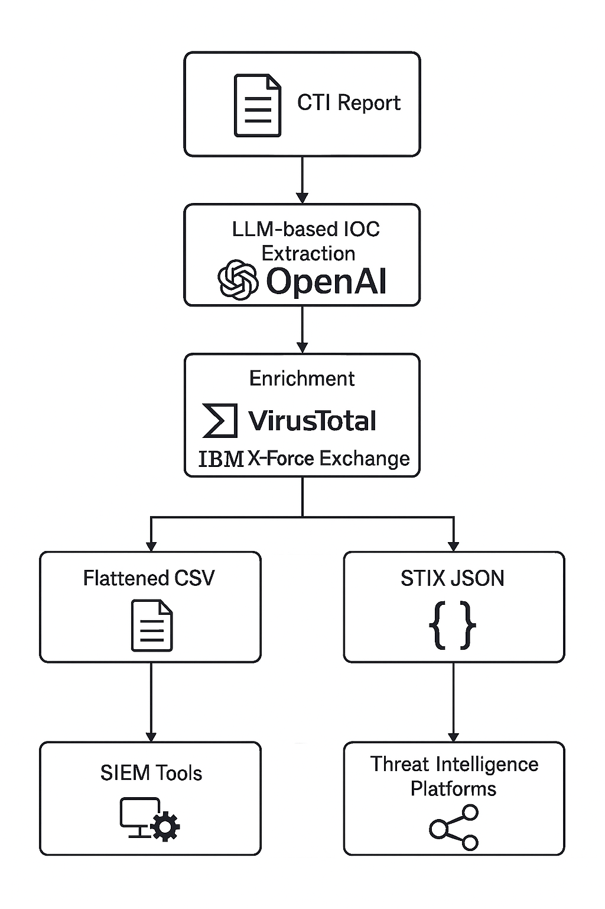
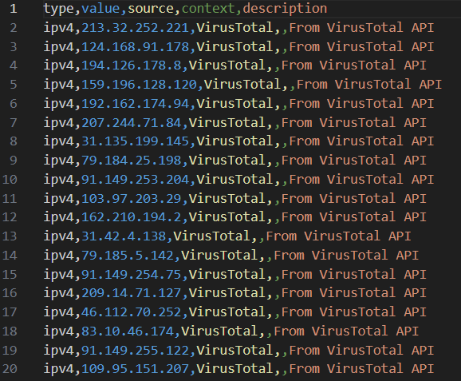
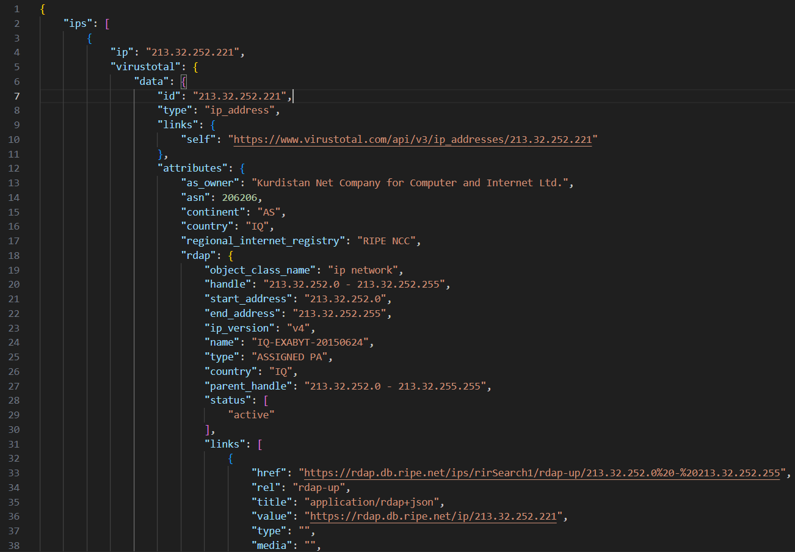
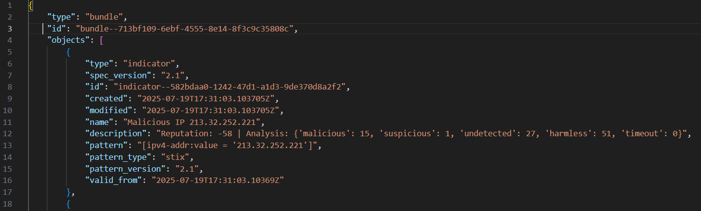
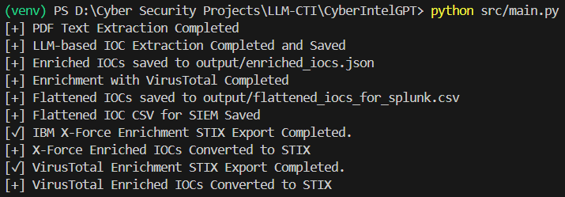

# CyberIntelGPT: LLM-Driven IOC Extraction & Enrichment with SIEM & TIP-Ready Outputs

## 📌 Overview

**CyberIntelGPT** is a cybersecurity automation project designed to extract Indicators of Compromise (IOCs) from unstructured Cyber Threat Intelligence (CTI) reports using Large Language Models (LLMs), enrich them through public threat intelligence platforms, and output them in formats suitable for SIEM tools and Threat Intelligence Platforms (TIPs).

This tool bridges the gap between unstructured CTI data and operational security tooling by transforming narrative reports into machine-ingestible intelligence for defensive operations.

---

## 📝 Input CTI Report

The provided CTI report used for this demo:
- **CSA_RUSSIAN_GRU_TARGET_LOGISTICS.pdf**
- Focus: Russian GRU targeting Western logistics & tech entities.
- [Official Report Reference (U.S. DoD & CISA)](https://www.cisa.gov/sites/default/files/2023-09/CSA_Russian-GRU-Targeting-Logistics-Sectors.pdf)

---

## 🔧 Project Structure

CyberIntelGPT/
├── assets/                    # Assets for diagrams & output screenshots
├── input/
│   └── CSA_RUSSIAN_GRU_TARGET_LOGISTICS.pdf   # Input CTI PDF Report
├── output/                     # Output files (examples below)
│   ├── enriched_iocs_with_virustotal.json      # Meaningful enriched output
│   ├── enriched_iocs_virustotal_stix.json      # Meaningful enriched output
│   ├── enriched_iocs_with_xforce.json          # Placeholder for demo (limited freemium enrichment)
│   ├── enriched_iocs_xforce_stix.json          # Placeholder for demo (limited freemium enrichment)
│   ├── flattened_iocs_for_splunk.csv           # CSV for SIEM ingestion
│   └── iocs_output.json                        # Intermediate result
├── src/                       # Core source files
│   ├── main.py
│   ├── enrich_with_virustotal.py
│   ├── enrich_with_xforce.py
│   ├── flatten_iocs_virustotal.py
│   ├── ioc_extractor.py
│   ├── pdf_parser.py
│   ├── stix_converter_virustotal.py
│   └── stix_converter_xforce.py
└── README.md

---

##  Pipeline Visualization



---

## 💡 How It Works

### 1️⃣ Extraction
- Extracts IOCs from PDF CTI reports using OpenAI GPT API (LLM-based extraction).

### 2️⃣ Enrichment
- Enriches IOCs using:
  - **VirusTotal API** (Free version provides meaningful enrichment)
  - **IBM X-Force Exchange API** (Free version provides limited/no enrichment)

### 3️⃣ Outputs
- **Flattened CSV** for SIEM tools (Splunk, QRadar, etc.)
- **STIX JSON** for Threat Intelligence Platforms (MISP, etc.)

---

## 🔥 Key Outputs Examples (Demo Screenshots)

### 📄 CSV Output Example for SIEM:


### 📑 JSON Enriched Output (VirusTotal):


### 🗂️ STIX JSON Enriched Output (VirusTotal):


### 🖥️ Terminal Execution Example:


---

## 💬 Important Notes
- **X-Force outputs are placeholders for demo only**. Limited enrichment due to freemium API.
- **VirusTotal outputs are meaningful and demonstrate the enrichment phase.**
- All API keys used are **free tier** except OpenAI, which requires $1-2 in credit.

---

## ⚙️ Running the Project

### Prerequisites:
- Python 3.x environment
- Activate your virtual environment:
```bash
# Windows
.env\Scriptsctivate

# Linux/MacOS
source venv/bin/activate
```

### Running the Full Pipeline:
```bash
python src/main.py
```

---

## 🔄 Running Stages Separately (Optional)
For clarity on each stage's output:
```bash
python src/pdf_parser.py
python src/ioc_extractor.py
python src/enrich_with_virustotal.py
python src/enrich_with_xforce.py
python src/flatten_iocs_virustotal.py
python src/stix_converter_virustotal.py
python src/stix_converter_xforce.py
```

---

## 🛠️ What to Modify for Your Project

| File               | What to Change                 |
|--------------------|--------------------------------|
| `config/config.yaml` | API keys (keep secret, not committed) |
| `input/`           | Place your own CTI reports      |
| `output/`          | Output paths as per your needs  |

---

## 🔍 Project Gap Addressed

**Gap:** Unstructured CTI reports → SIEM/TIP-ready structured outputs.  
**Problem:** Manual parsing of CTI reports is inefficient, error-prone, and lacks scalability. SIEM and TIPs require structured inputs.

**How This Project Bridges It:**
- Automates extraction from CTI reports using LLMs.
- Provides machine-ingestible, enriched outputs ready for operational use (CSV for SIEM / STIX for TIP).
- Bridges the gap between CTI analysts and operational security tooling with clarity, speed, and accuracy.

---

## 📥 License & Contribution

This project is open-source and freely available for educational, research, and non-commercial cybersecurity use cases.  
Anyone is welcome to fork, reuse, or extend it for their own CTI pipelines or related projects.

**Pull requests for improvements or suggestions are highly encouraged.**

---

## 📌 Disclaimer
The outputs are from real CTI data but were **not tested on live SIEM or TIP tools**.

---
